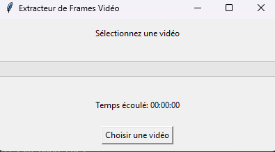

# Extracteur de Frames Vidéo

Une application simple qui permet d'extraire toutes les frames d'une vidéo, de les enregistrer dans un dossier spécifique avec un nom personnalisé, et d'afficher des informations détaillées sur la vidéo. L'interface graphique est réalisée avec `Tkinter`, et le traitement vidéo avec `OpenCV`.

## Fonctionnalités

- Sélectionner une vidéo à partir de votre système de fichiers.
- Extraire toutes les frames de la vidéo et les sauvegarder dans un dossier choisi par l'utilisateur.
- Personnaliser le nom des frames.
- Affichage en temps réel du nombre de frames extraites et d'une barre de progression.
- Affichage du temps écoulé pendant l'extraction dans le format `jj:hh:mm:ss`.
- Affichage des statistiques de la vidéo : 
  - FPS (images par seconde)
  - Nombre total de frames
  - Durée de la vidéo
  - Résolution de la vidéo
  - Taille du fichier vidéo

## Prérequis

Avant de pouvoir exécuter l'application, vous devez installer les dépendances suivantes :

- **Python 3.6+**
- Bibliothèques Python suivantes :
  - `opencv-python`
  - `tkinter` (inclus par défaut avec Python)
  
Vous pouvez installer OpenCV en utilisant la commande suivante :

```bash
pip install opencv-python
```

## Installation

1. Clonez ce dépôt sur votre machine locale :
   ```bash
   git clone https://github.com/Loocist23/onebyone.git
   ```
   
2. Accédez au répertoire du projet :
   ```bash
   cd onebyone
   ```

3. Installez les dépendances nécessaires :
   ```bash
   pip install -r requirements.txt
   ```

## Utilisation

1. Exécutez le script `main.py` pour lancer l'application :
   ```bash
   python main.py
   ```

2. Sélectionnez la vidéo dont vous souhaitez extraire les frames.

3. Choisissez le dossier où les frames seront enregistrées.

4. Entrez un nom pour les frames (par exemple, `frame`).

5. Suivez la progression de l'extraction via la barre de progression et le timer affichés.

6. Les statistiques de la vidéo seront également affichées, comprenant la durée, la qualité (résolution), et la taille du fichier.

## Exemple d'interface



## Auteurs

- **Loocist23** - [Loocist23](https://github.com/Loocist23)

## License

Ce projet est sous licence MIT - voir le fichier [LICENSE](LICENSE) pour plus de détails.
